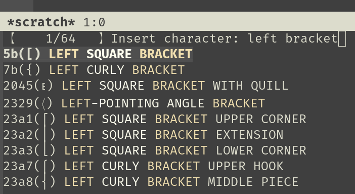

Insert Unicode char similar to `insert-char` command, but with character preview in completion
prompt.



## Installation

```elisp
(use-package insert-char-preview
    :commands insert-char-preview
    :bind ("C-x 8 RET" . insert-char-preview))
```
